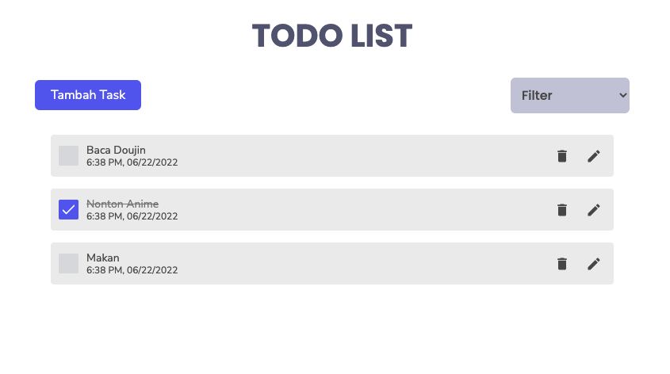

# Todo App

A complete todo application with all features.

**live demo: [https://fajaragngn.github.io/todo-app/](https://fajaragngn.github.io/todo-app/)**

---

## What we are going to learn/use

- [React](https://reactjs.org/)
- [React Redux](https://redux.js.org/)
- [Framer Motion](https://framer.com/motion/)
- [React icons](https://react-icons.netlify.com/)
- [React Hot Toast](https://react-hot-toast.com/)



## Getting Started

```shell
npm install
```

and after that start the dev server.

```shell
npm start
```
